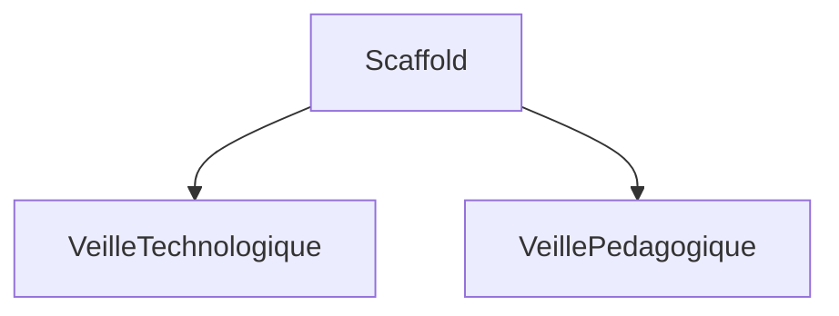

# [SPEC-XXX] Scaffold Intel Portal

> **Statut** : `draft`
> **Priorité** : `critical`
> **Auteur** : @jb
> **Date** : 2026-03-04
> **Itération** : Sprint 1 / Phase 1

---

## Contexte

On souhaite développer un portail pour concentrer les informations en lien avec la veille technologique et pédagogique qui concernent les programmes d'IT-Akademy.
L'objectif est de permettre aux collaborateurs de consulter les informations en lien avec la veille technologique et pédagogique qui concernent les programmes d'IT-Akademy sous forme d'un tableau de bord moderne et ergonomique, comparable à un tableau de bord de veille en temps réel.

## Objectifs

- [ ] Scaffold de base
- [ ] Intégration de la veille technologique
- [ ] Intégration de la veille pédagogique

## Non-objectifs (hors périmètre)

- [ ] Intégration de la veille académique
- [ ] Intégration de la veille de la communauté

---

## User Stories

### US-1 : Scaffold de base

**En tant que** développeur, **je veux** un scaffold de base, **afin de** pouvoir commencer le développement du portail.

**Critères d'acceptation :**

- [ ] Critère 1 : Le scaffold est fonctionnel
- [ ] Critère 2 : Le scaffold est conforme aux normes de qualité

### US-2 : Intégration de la veille technologique

**En tant que** développeur, **je veux** intégrer la veille technologique, **afin de** pouvoir commencer le développement du portail.

**Critères d'acceptation :**

- [ ] Critère 1 : La veille technologique est fonctionnelle
- [ ] Critère 2 : La veille technologique est conforme aux normes de qualité

### US-3 : Intégration de la veille pédagogique

**En tant que** développeur, **je veux** intégrer la veille pédagogique, **afin de** pouvoir commencer le développement du portail.

**Critères d'acceptation :**

- [ ] Critère 1 : La veille pédagogique est fonctionnelle
- [ ] Critère 2 : La veille pédagogique est conforme aux normes de qualité

---

## Design Technique

### Architecture



### Nouveau(x) Composant(s)

| Fichier                      | Type      | Responsabilité |
| ---------------------------- | --------- | -------------- |
| `src/components/Example.tsx` | Component | Description    |
| `src/app/example/page.tsx`   | Page      | Description    |

### Modèle de Données

```typescript
interface Example {
  id: string;
  // ...
}
```

### API / Routes

| Méthode | Route          | Description        |
| ------- | -------------- | ------------------ |
| `GET`   | `/api/example` | Liste des éléments |
| `POST`  | `/api/example` | Création           |

---

## UI / UX

### Maquettes

> Insérer des liens vers des maquettes, wireframes, ou captures :

### États d'interface

| État       | Comportement       |
| ---------- | ------------------ |
| Chargement | Skeleton / spinner |
| Vide       | Message + CTA      |
| Erreur     | Toast / bannière   |
| Succès     | Confirmation       |

---

## Plan d'Implémentation

### Phase 1 — Fondation

- [ ] Tâche 1 : Scaffold de base
- [ ] Tâche 2 : Intégration de la veille technologique
- [ ] Tâche 3 : Intégration de la veille pédagogique

### Phase 2 — Intégration

- [ ] Tâche 4 : Intégration de la veille académique
- [ ] Tâche 5 : Intégration de la veille de la communauté

### Phase 3 — Polish

- [ ] Tâche 6 : Intégration de la veille académique

---

## Tests & Validation

### Tests Automatisés

- [ ] Unit tests pour la logique métier
- [ ] Tests de composants (rendering, interactions)

### Vérification Manuelle

- [ ] Responsive (mobile, tablet, desktop)
- [ ] Dark theme
- [ ] Accessibilité (clavier, screen reader)
- [ ] Performance (Lighthouse > 90)

---

## Risques & Dépendances

| Risque   | Impact | Mitigation |
| -------- | ------ | ---------- |
| Risque 1 | `high` | Plan B     |

| Dépendance   | Statut                  |
| ------------ | ----------------------- |
| Dépendance 1 | ✅ Prêt / ⏳ En attente |

---

## Notes & Références

- [Lien vers documentation](https://example.com)
- Décisions prises lors de la discussion du YYYY-MM-DD
